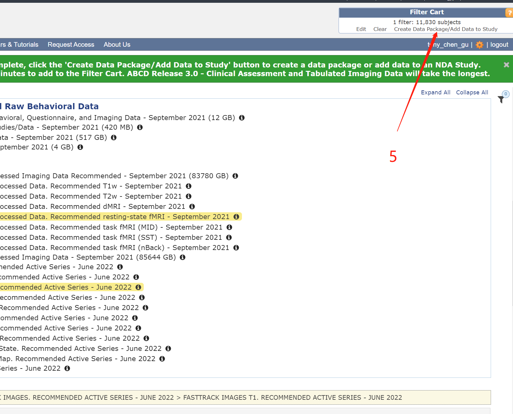

# fMRI Brain Network Construction

The fmri brain network construction is a BIDS-formatted fMRI data processing pipeline for general researchers to build their own functional brain network from fMRI data. We use the existing [ABCD-HCP BIDS fMRI Pipeline](https://github.com/DCAN-Labs/abcd-hcp-pipeline), which combines complicated FSL, Freesurfer, and Linux commands into one docker command. The detailed pipeline description could be found at [ABCD-BIDS Community Collection (ABCC)](https://collection3165.readthedocs.io/en/stable/pipeline/).

## Preparation:
### System requirement:
- Linux or MacOS (Intel Core)
### Requirements
- [Docker](https://docs.docker.com/get-docker/) or [Singularity](https://sylabs.io/guides/3.5/user-guide/quick_start.html)
    - All tools used would be downloaded and configured inside of `Docker` and `Singularity`
- [FreeSurfer license](https://surfer.nmr.mgh.harvard.edu/fswiki/License)
- DICOM to NIFTI tools (eg. [MRIcroGL](https://www.nitrc.org/projects/mricrogl))

## Install the Pipeline
- With Docker
    ```shell
    docker pull dcanumn/abcd-hcp-pipeline
    ```
- With Singularity
    ```shell
    singularity pull docker://dcanumn/abcd-hcp-pipeline

    singularity build abcd-hcp-pipeline.sif docker://dcanumn/abcd-hcp-pipeline
    ```
## Run the Pipeline
- The raw data should be in BIDS format. Take the ABCD dataset as an example using the subject (NDARINV003RTV85)
    1. Make sure you have access to ABCD data on [NDA](nda.nih.gov)
    2. Create your own data package by following the numbers.
       
       
       
       
    1. Using the [NDADownLoadManager](https://nda.nih.gov/static/docs/NDA_Download_Manager_User_Guide_v0.1.38.pdf) to download the raw T1 images (ABCD-T1-NORM_run-20181001100823) and processed fmri and T1 images.
       
       
    1. The processed fmri and T1 images are already in BIDS format, so we could directly combine two folders.
       
    1. Extract the raw T1 image and convert it to .nii. Using any dcm to nii tools (eg. [MRIcroGL](https://www.nitrc.org/projects/mricrogl)) to convert the raw data (ABCD-T1-NORM_run-20181001100823) to nii.
    2. We need its json file to supplement processed T1 json. Using the converted json to supplement the processed T1 json according to the following image.
       

- With Docker
    ```shell
    docker run --rm \
    -v /path/to/bids_dataset:/bids_input:ro \
    -v /path/to/outputs:/output \
    -v /path/to/freesurfer/license:/license \
    dcanumn/abcd-hcp-pipeline /bids_input /output --freesurfer-license=/license.txt [OPTIONS]
    ```
- With Singularity
    ```shell
    env -i singularity run \
    -B /path/to/bids_dataset:/bids_input \
    -B /path/to/outputs:/output \
    -B /path/to/freesurfer/license.txt:/opt/freesurfer/license.txt \
    ./abcd-hcp-pipeline.sif /bids_input /output --freesurfer-license=/opt/freesurfer/license.txt [OPTIONS]
    ```

- My Docker command:
    ```shell
    docker run --rm \
    -v /mnt/d/ABIDE/full_steps/subject_data_old:/bids_input:ro \
    -v /mnt/d/ABIDE/full_steps/latest_output:/output \
    -v /home/chentony2011/license.txt:/license \
    dcanumn/abcd-hcp-pipeline /bids_input /output --freesurfer-license=/license --ncpus 15
    ```

- If you met error message like:
    ```shell
    Exception: error caught during stage: DCANBOLDProcessing
    ```
  try version v0.1.0 of the pipeline. With command `-stage DCANBOLDProcessing` to specify the starting stage.
    ```shell
    docker run --rm \
    -v /mnt/d/ABIDE/full_steps/subject_data_old:/bids_input:ro \
    -v /mnt/d/ABIDE/full_steps/latest_output:/output \
    -v /home/chentony2011/license.txt:/license \
    dcanumn/abcd-hcp-pipeline:v0.1.0 /bids_input /output --freesurfer-license=/license --ncpus 15 --stage DCANBOLDProcessing
    ```

## Generate Network
- The pipeline above won't generate the network automatically. You will need to run the script `generate_network.py` to generate the network.
- The pipeline output is in the structure:
    ```
    output_dir/
    |__ sub-id
        |__ ses-session
            |__ files
            |   |__DCANBOLDProc<ver>
            |   |__summary_DCANBOLDProc<ver>
            |   |  |__executivesummary
            |   |__ MNINonLinear
            |   |   |__ fsaverage_LR32k
            |   |   |__ Results
            |   |__ T1w
            |   |   |__ id
            |   |__[T2w]   
            |   |__ task-<taskname>
            |__ logs
    ```
- The file used to generate brain network is placed in the folder `output_dir/sub-id/ses-session/files/MNINonLinear/Results/`. All files ends with `.ptseries.nii` can be used to generate the network.
- To generate network put the script provided **`generate_network.py`** in the folder and run it. The output network would be saved as a `.mat` file in a folder named `connectivity_output`.
- You could change the input folder, output folder, and the connectivity measure in the code.
## More Options
    ```shell
    Positional Arguments:
        bids_dir                Path to the BIDS data.

        output_dir              Path to the output directory.

    Optional Arguments:

        -h / --help             Show the function help and exit.

        -v / --version          Show the version of the package and exit.

        --participant-label     ID [ID...]
                                Specify the participant ID desired to run.
                                Default is to run all participant in the directory.
        --session-id            SESSION_ID [SESSION_ID ...]

                                Specify the Session ID desired to run. (Exclude "ses-")
                                Default is to run all participant in the directory.

        --freesurfer-license    LICENSE_FILE

        --all-sessions          Merge all sessions into one for each subject.

        --ncpus                 NCPUS
                                Number of cores to run the pipeline.

        --stage                 STAGE
                                Specified the desired substage to run.

        --bandstop              LOWER UPPER
                                Motion regressor band-stop filtering parameter.

        --custom-clean          JSON
                                Run the DCAN automatic cleaning script based on the 
                                specified file structure provided after the pipeline.

        --study-template        HEAD BRAIN
                                Head and brain template for intermediate
                                nonlinear registration and masking.

        --ignore {func,dwi}     Ignore the modality in processing.

    Runtime Arguments: (For debugging use)
        --check-outputs-only   Check the existence of the output.

        --print-commands-only   Only print out the command used to run each stage.

        --ignore-expected-outputs
                                Continue the pipeline with missing expected output.
    ```