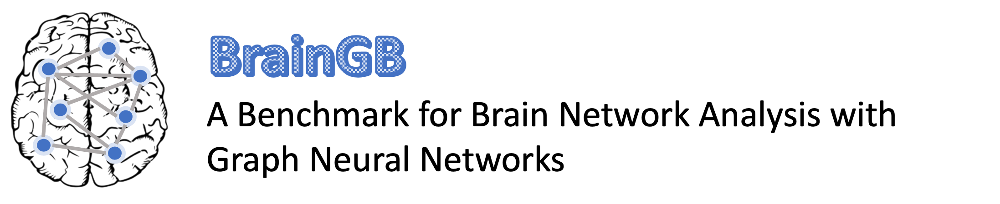

[//]: # ()

# **Guide to Using BrainGB**

This guide provides a tutorial on running direct experiments with BrainGB and integrating BrainGB into your existing research projects. Follow the sections below to learn more.

All source code is stored at [BrainGB's GitHub repository](https://github.com/HennyJie/BrainGB).

### **Table of Contents**
1. [Direct Experiments with BrainGB](#part-i-direct-experiments-with-braingb)
    - [Obtaining Datasets](#1-obtaining-datasets)
    - [Quick Setup](#2-quick-setup)
    - [Running Example](#3-running-example)
2. [Integrating BrainGB into Your Workflow](#part-ii-integrating-braingb-into-your-workflow)
    - [Install BrainGB as a Package](#1-install-braingb-as-a-package)
    - [Incorporating BrainGB Models](#2-incorporating-braingb-models)

---

## **Part I: Direct Experiments with BrainGB**

### **1. Obtaining Datasets**

#### **ABIDE Dataset**
We understand the challenges faced by researchers in accessing certain datasets due to restrictions. To facilitate your experimentation with BrainGB, we provide the [Autism Brain Imaging Data Exchange (ABIDE) dataset](http://fcon_1000.projects.nitrc.org/indi/abide/abide_I.html), which is publicly accessible and does not require special access permissions. 

- [Download and Preprocess ABIDE dataset here](https://github.com/HennyJie/BrainGB/tree/master/examples/utils/get_abide)


#### **Datasets Requiring Access**
For a detailed exploration of other datasets like **PNC**, **PPMI**, and **ABCD** utilized in our BrainGB studies, which are not publicly accessible and require specific access permissions, please refer to the following:

- [Other Datasets and Decription](https://braingb.us/datasets/)

- [Preprocessing Steps and Protocols](https://braingb.us/preprocessing/)


You can also construct your own datasets by following the instructions on neuroimaging preprocessing and functional or structural brain network construction on our [website](https://braingb.us/preprocessing/).

---

### **2. Quick Setup**

Clone the repository and Install required dependencies:
```shell
git clone https://github.com/HennyJie/BrainGB.git
```
Navigate to the repository and install dependencies:
```shell
pip install -r requirements.txt
```
BrainGB depends on the following packages:
```
torch~=1.10.2
numpy~=1.22.2
nni~=2.4
PyYAML~=5.4.1
scikit-learn~=1.0.2
networkx~=2.6.2
scipy~=1.7.3
tensorly~=0.6.0
pandas~=1.4.1
libsvm~=3.23.0.4
matplotlib~=3.4.3
tqdm~=4.62.3
torch-geometric~=2.0.3
h5py~=3.6.0
```

---

### **3. Running Example**
Use the ABIDE dataset as an example, you should first place the dataset file "abide.npy" (genereated from [step 1](#1-obtaining-datasets)) in the `datasets` folder under the `examples` folder (Create the folder if it does not exist). The `abide.npy` file contains the following contents:

- **timeseries**: Represents the BOLD time series data for each subject. It's a numpy array with the shape (#sub, #ROI, #timesteps).
  
- > **Label**: Provides the diagnosis label for Autism spectrum disorder for each subject. '0' denotes negative, and '1' indicates positive. It's a numpy array of shape (#sub).
  
- > **corr**: The correlation matrix calculated from BOLD time series data. It's a numpy array with the shape (#sub, #ROIs, #ROIs).
  
- **pcorr**: Represents the partial correlation matrix derived from the BOLD time series data. It's a numpy array with dimensions (#sub, #ROIs, #ROIs).
  
- **site**: Specifies where the data was collected for each subject. It's a numpy array with shape (#sub).

**`Important Note`**: `"Label"` and `"corr matrix"` are the actual *inputs* for BrainGB. `Label` represents the target outcome we are interested in predicting, often indicating the diagnosis or condition of a subject in a brain study. `corr matrix` describes the associated Brain Network. If you are considering running BrainGB using your own dataset, it's important to format your Label and corr matrix similarly to ensure compatibility and accurate results. Ensure that `Label` is in a *numpy array* of shape **(#sub)** and `corr matrix` is structured as a *numpy array* with the shape **(#sub, #ROIs, #ROIs)**.<br><br>


**Run the BrainGB code, execute the following command**:
```shell
python -m main.example_main --dataset_name ABIDE --pooling concat --gcn_mp_type edge_node_concate --hidden_dim 256
```
The parameter `pooling` specifies the pooling strategy to get a graph-level representation for each subject and `gcn_mp_type` sets a message vector design for the `gcn` model. If you choose `gat` as the backbone model, you can use `gat_mp_type` to set an attention-enhancing mechanism.

For other hyper-parameters like `--n_GNN_layer`, `--n_MLP_layers`, `--hidden_dim`, `--epochs`, etc., you can modify them to adjust the detailed model design or control the training process. If you'd like to automatically search and optimize these hyper-parameters, use the AutoML tool NNI with the `--enable_nni` command.

For detailed explanations and additional parameters, consult the code comments or the [Advanced page](https://braingb.us/advanced/).


Upon successful execution, you should observe an output similar to this:

```plaintext
Processing...
Done!
2023-09-10 15:54:28,486 - Loaded dataset: ABIDE
...
2023-09-10 15:56:29,493 - (Train Epoch 9), test_micro=66.34, test_macro=65.10, test_auc=72.91
...
2023-09-10 17:37:46,561 - (Train Epoch 99), test_micro=64.68, test_macro=64.59, test_auc=70.03
2023-09-10 17:37:47,489 - (Initial Performance Last Epoch) | test_micro=64.68, test_macro=64.59, test_auc=70.03
2023-09-10 17:37:47,489 - (K Fold Final Result)| avg_acc=65.31 +-  1.58, avg_auc=71.29 +- 2.89, avg_macro=64.43 +- 1.87
```

---

## **Part II: Integrating BrainGB into Your Workflow**

### **1. Install BrainGB as a package**


To integrate BrainGB into your research projects and leverage its capabilities, install the package via your package manager:

```shell
pip install BrainGB
```
Notice that if you install the package through pip, the dependencies are automatically installed.

### **2. Incorporating BrainGB Models**

BrainGB provides modular components, making it easier to integrate with various projects. Import the necessary modules and initialize the models according to your research needs.

```python
from BrainGB.models import GAT, GCN, BrainNN
```
The BrainNN is required and will be served as the parent module of the GAT, GCN models. You may choose either GAT or GCN as the submodule.

**Model Initialization**:  
For a GCN-based setup:
```python
sample: Data = Data()  # A torch geometric data
num_features = data.x.shape[1]
num_nodes = data.x.shape[0]
gcn_model = GCN(num_features, num_nodes)
model = BrainNN(args.pooling, gcn_model, MLP(2 * num_nodes))
```
For a GAT-based setup, simply replace the GCN model initializations with GAT. Further model customization options are available on the [Advanced page](https://braingb.us/advanced/).


## **Contribution**

We welcome contributions to the package. Please feel free to open an issue or pull request.
